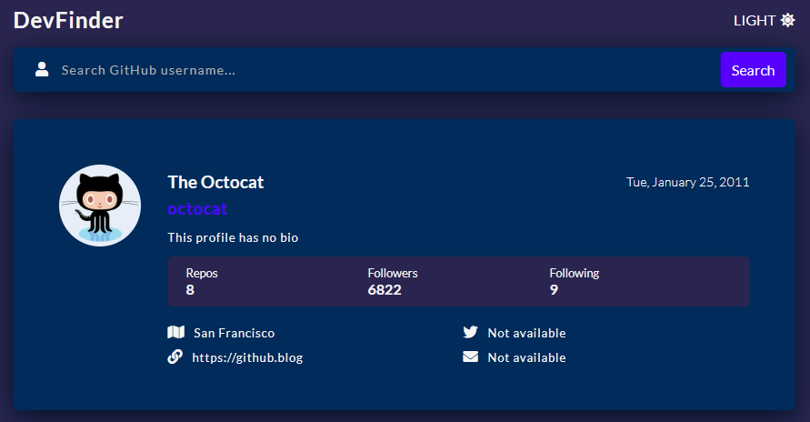
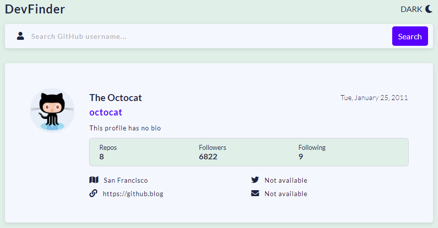

# GitHub user search app

It is an application that provides information of a github user if you search for him by his username. [Click here to see the project](https://github-user-finder-guf.netlify.app/ "click here to see the project")

### Provided information:

- Name
- Username
- Bio
- Repos
- Followers
- Following
- Location
- Twitter username
- Blog
- Email

&nbsp;

## Features

---

### Dark Mode

### Light Mode

